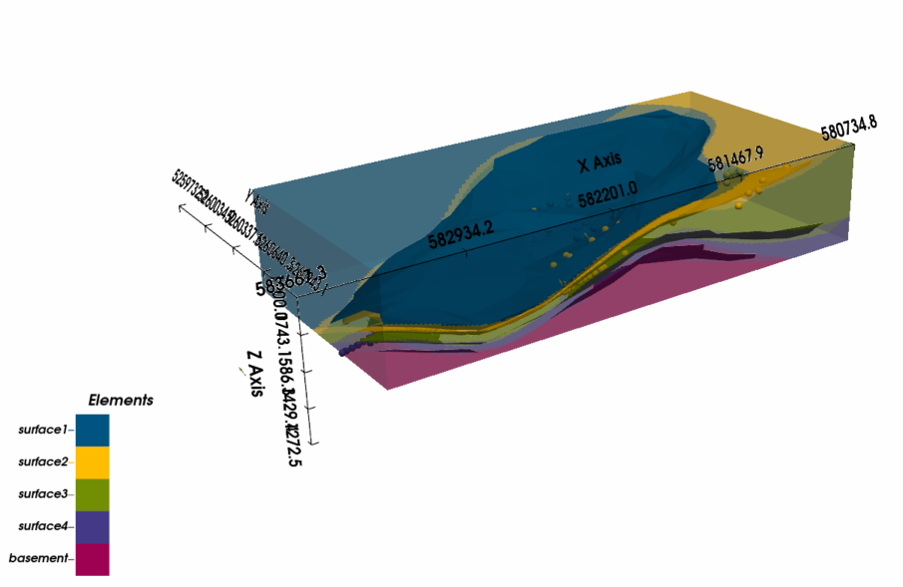

# A 3D Geological Model of the Molasse Unit in the Hochgrat Region, Allgäu, Germany

This notebook presents a 3D geological modeling workflow for the Molasse unit in the Hochgrat region, Allgäu, Germany. The model is based on field-observed bedding and structural orientation data collected from Alpine outcrops, combined with high-resolution terrain data from BayernAtlas.

